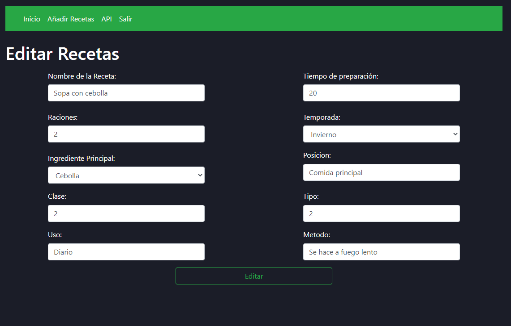

# Proyecto Final DAW

## Herramientas

|      PHP       |  HTML   |                 JS                  |          MySql          |          CSS          |          TWIG
|:-------------:|:------:|:--------------------------------------:|:--------------------------------------:|:--------------------------------------:|:--------------------------------------:|
 |  |  |  |  | 

## Registro

## Loguin

## Inicio

## información de la recetas

## registro de rectea

## Editar receta

